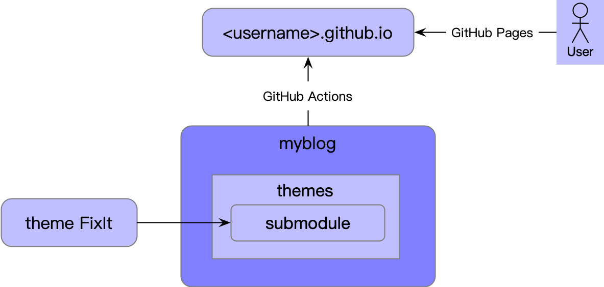
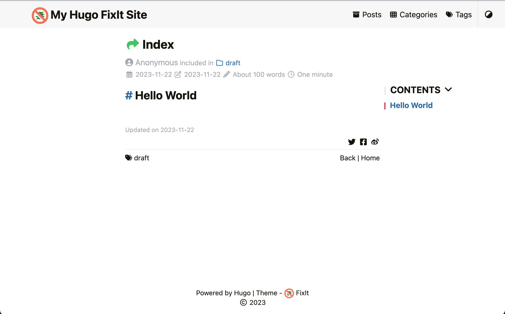
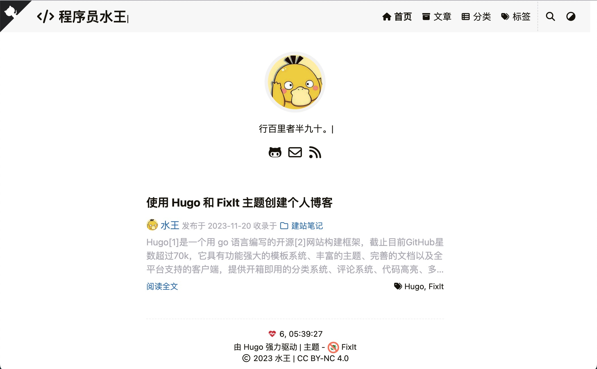
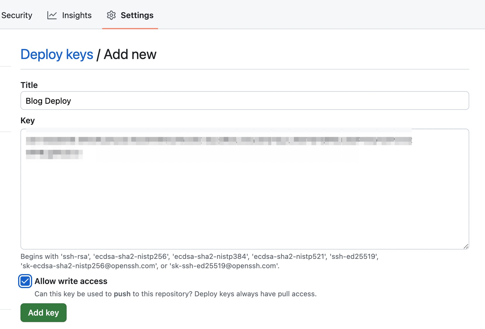
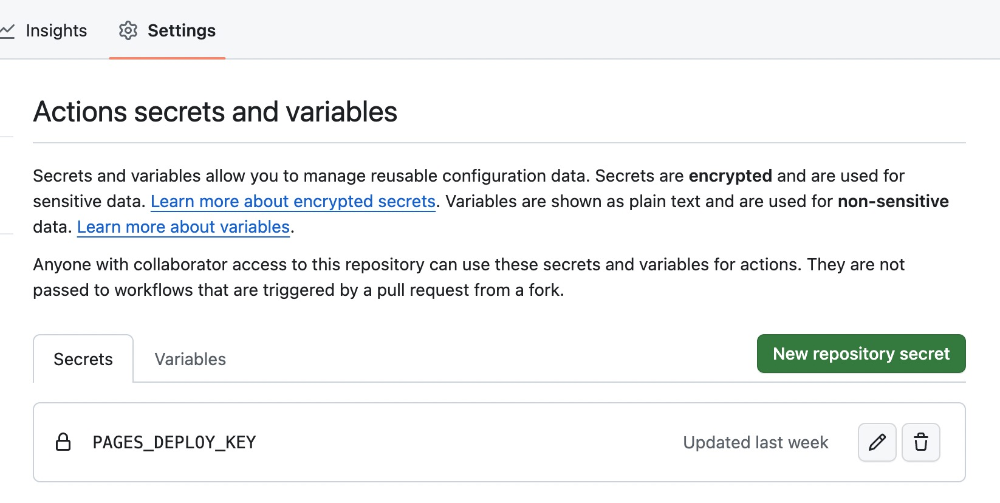
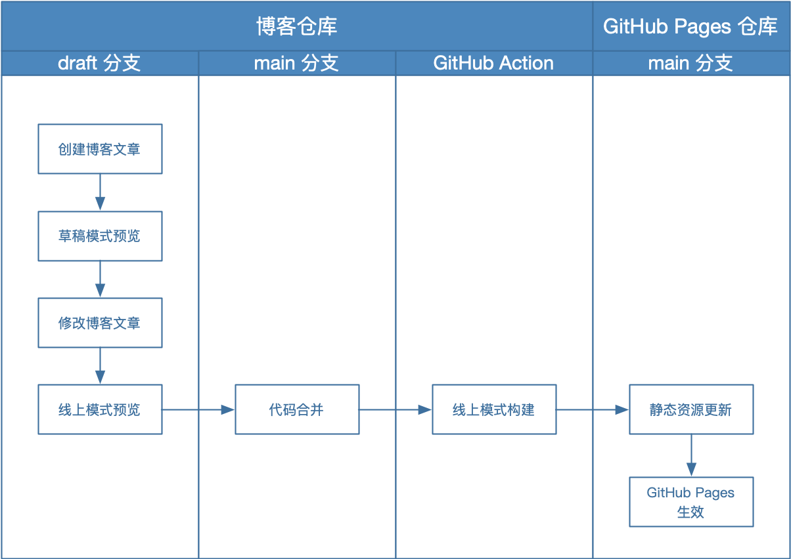

# 使用 Hugo 和 FixIt 主题创建个人博客


Hugo[[1]]是一个用 go 语言编写的开源[[2]]网站构建框架，截止目前GitHub星数超过70k，它具有功能强大的模板系统、丰富的主题、完善的文档以及全平台支持的客户端，提供开箱即用的分类系统、评论系统、代码高亮、多语言支持等功能，非常适合用来搭建博客网站。

在本地撰写阶段，借助 Hugo 内置服务器可以做到毫秒级热更新，实现所见即所得。同时，得益于 Hugo 采用静态站点生成[[3]]的架构，Hugo 站点可以很容易的部署到各种 HTTP 服务器，且通过本地预览即可确认线上部署效果。

基于成本和使用习惯考虑，选择使用 GitHub Pages 进行部署，并且根据功能不同进行仓库拆分。话不多说，来开始吧。

## 环境安装
Hugo 分为标准和扩展两个版本，扩展版支持 WebP 图像处理以及 Dart Sass，这里我们选择安装扩展版本。

参考官方安装指南[[4]]，前置准备需要安装 Git、Go 和 Dart Sass [[5]]，mac系统可直接使用 homebrew 进行安装，我的电脑上 Git 和 Go 已经安装好，只需要安装 Dart Sass：
```shell
# 添加 tap 源
$ brew tap sass/sass
# 安装 Dart Sass
$ brew install sass/sass/sass
# 验证
$ sass --version
1.69.5
```
安装 Hugo：
```shell
# Hugo 安装
$ brew install hugo
# 验证
$ hugo version
hugo v0.120.4-f11bca5fec2ebb3a02727fb2a5cfb08da96fd9df+extended darwin/arm64 BuildDate=2023-11-08T11:18:07Z VendorInfo=brew
```
可以看到 hugo 版本信息中包含 +extended 信息，说明安装的是 Hugo 扩展版。

## 博客创建
从 Hugo 主题站[[6]]挑选自己喜欢的主题，大多数主题都有 demo 可以体验，我选的是 [FixIt](https://themes.gohugo.io/themes/fixit/)。

### GitHub 仓库准备
接下来创建三个 GitHub 仓库：
1. GitHub Pages 仓库：仓库名前缀必须使用用户名，格式为\<username\>.github.io，必须为公开仓库，用于博客部署。
2. 博客仓库：可随意命名如 myblog，私有仓库，用于存储博客源代码，包括文章和配置。
3. 主题仓库：从 FixIt 源代码库[[7]] fork，用于自定义配置主题，另外我 fork 过来后将默认分支从 master 重命名成了 main。

三个仓库的关系如图所示：



博客仓库将主题以 submodule 的形式导入到 themes 文件夹，通过配置文件指定使用的主题；当博客仓库的代码提交到 main 分支时，会触发 GitHub Actions 将 Hugo 构建好的静态站点文件部署到 GitHub Pages 仓库，用户即可通过 GitHub Pages 域名进行博客访问。

三个仓库中，只有 GitHub pages 仓库是必须的，如果不在意博客内容和源代码隐私性，可以去掉 myblog 仓库，将博客源代码存储到 \<username\>.github.io 仓库中，GitHub Pages 支持使用特定分支（默认是 gh-pages）部署。如果不准备自定义修改主题，可以去掉 FixIt 仓库，直接使用官方源代码仓库或者通过 Hugo module 进行主题安装。

### 博客站点创建
仓库准备好之后，可以通过 Hugo 命令行工具[[8]]快速创建站点，Hugo 默认使用 toml 格式配置，同时支持 yaml 和 json，我的博客使用 yaml：
```shell
$ hugo new site --format yaml myblog
# 切换到博客仓库目录
$ cd myblog

# 初始化 git 仓库
$ git init
$ git add .
$ git commit -m "feat: init hugo site"

# 绑定远程博客仓库
$ git remote add origin git@github.com:will4j/myblog.git
$ git push -u origin main

# 增加主题子模块
# 这里因为 fork 主题仓库跟博客仓库在同一目录下，采用相对路径引入
$ git submodule add ../FixIt.git themes/FixIt

# 设置主题
$ echo "theme: FixIt" >> hugo.yaml
$ cat hugo.yaml
baseURL: https://example.org/
languageCode: en-us
title: My New Hugo Site
theme: FixIt
```

Hugo 默认的站点目录结构[[9]]如下：
+ archetypes：原型目录，用于定义各种类型的内容模板。原型匹配顺序是优先本站点内，其次再到主题内查找。
+ assets：资产目录，用于放置 CSS，JavaScript 等全局资源库。
+ config：配置文件目录，主配置文件 hugo.yaml，支持多文件配置、多环境配置[[10]]。
+ content：内容目录，用于放置文章、分类、标签等内容页面。
+ data：数据目录，用于存取自定义配置数据。
+ i18n：国际化目录，用于页面文本的多语言翻译。
+ layouts：布局目录，用于放置 html 模板。
+ public：部署目录，用于存放 Hugo 构建的静态站点文件。
+ resources：资源目录，包含 Hugo 资产构建流水线产生的可缓存文件，如 CSS、图片等。
+ static：静态资源目录，该目录下的文件会被直接拷贝到站点根目录。
+ themes：主题目录，包含 Hugo 站点可以使用的主题。

可通过 Hugo mounts 配置[[11]]自定义站点目录结构。

### 文章创建及预览
Hugo 支持 Page bundles [[12]]模式，即文章内容打包在一个文件夹下，内部可以独立包含图片、子页面等静态资源，文章以 index.md 作为入口，可基于 FixIt 主题提供的 post-bundle 原型进行自定义修改：
```shell
# 拷贝主题原型到站点目录
$ cp -r themes/FixIt/archetypes/post-bundle archetypes
# 增加博客图片目录，最终结构如下，注意空目录在原型使用时不会生效
$ tree -a archetypes/post-bundle
archetypes/post-bundle
├── images
│   └── .gitkeep
└── index.md

# 创建 Page bundles 文章
$ hugo new content --kind post-bundle posts/hello-world
# 文章目录结构
$ tree -a content/posts/hello-world
content/posts/hello-world
├── images
│   └── .gitkeep
└── index.md

# 添加 markdown 内容
$ echo "\n## Hello World" >> content/posts/hello-world/index.md
```
上面的命令已经成功配置主题并创建了一篇文章，现在可以通过`hugo server --buildDrafts`命令启动本地预览服务，访问启动信息中显示的地址，如`http://localhost:1313`，进入首页，点击文章即可预览博客：



查看文章 index.md，其内容分为两部分：前置页[[13]]和文章主体。前置页用于配置文章元数据，如标题、分类、标签等显示设置以及评论是否开启等控制开关，文章主体是 markdown 内容。下面是一段前置页示例，yaml 格式前置页由`---`包裹：
```yaml
# content/posts/hello-world/index.md
---
# 文章标题
title: Index
# 文章创建时间
date: 2023-11-22T06:51:28+08:00
# 是否草稿
draft: true
# 标签和分类
tags:
  - draft
categories:
  - draft
---
```
前置页除了 Hugo 预定义的标签外，也支持用户自定义标签，比如 FixIt 主题就定义了很多自定义前置页标签[[14]]。

至此，博客站点的基本框架就搭起来了。

## 博客配置
通过 Hugo 和 FixIt 主题配置来调整博客显示布局，配置文件目录如下：
```shell
$ tree -a config/_default
config/_default
├── author.yaml # 作者信息配置
├── hugo.yaml # Hugo 主配置
├── languages.yaml # 多语言配置
├── menus.yaml # 菜单配置，菜单也支持多语言，当前只配置中文
├── module.yaml # 模块、目录挂载配置等
├── outputs.yaml # 输出格式配置
├── params.yaml # 额外参数配置，主题配置主要在这个文件
├── permalinks.yaml # 站点路径映射
└── sitemap.yaml # 站点地图配置，主要用于 seo 优化
```

配置文件来源于 Hugo 定义变量[[15]] 和 FixIt 主题定义变量[[16]]。最终展示效果如下：



### 顶部菜单
创建首页、文章、分类和标签四个菜单，调整中文命名。FixIt 主题支持 FontAwesome 图标[[17]]，可以根据个人喜好挑选。

```yaml
# config/_default/menus.yaml
---
# https://gohugo.io/content-management/menus
# https://gohugo.io/content-management/multilingual/#menus
# https://fixit.lruihao.cn/documentation/basics/#menu-configuration
# https://fontawesome.com/icons
main:
  - identifier: home
    name: 首页
    url: /
    weight: 1
    params:
      icon: fa-solid fa-home
  - identifier: posts
    name: 文章
    url: /posts/
    weight: 2
    params:
      draft: false
      icon: fa-solid fa-archive
  - identifier: categories
    name: 分类
    url: /categories/
    weight: 3
    params:
      icon: fa-solid fa-th-list
  - identifier: tags
    name: 标签
    url: /tags/
    weight: 4
    params:
      icon: fa-solid fa-tags
```

### 搜索支持
FixIt 主题支持 Lunr.js、algolia 和 Fuse.js 三种搜索方式。

前置条件需要增加 json 输出格式，以生成搜索依赖的 index.json：

```yaml
# config/_default/outputs.yaml
---
# https://gohugo.io/templates/output-formats/#customizing-output-formats
# https://gohugo.io/templates/output-formats/#output-format-definitions
home:
  - html
  - rss
  - json
page:
  - html
  - markdown
```
配置使用 Fuse.js 搜索，忽略大小写：
```yaml
# config/_default/params.yaml
---
# https://fixit.lruihao.cn/documentation/basics/#search-configuration
search:
  enable: true
  type: fuse
  fuse:
    # https://fusejs.io/api/options.html
    isCaseSensitive: false
```

### 博客标题
修改默认顶部标题，去除 logo，使用 fa 图标，增加打字特效：
```yaml
# config/_default/params.yaml
---
header:
  title:
    logo: ""
    name: Programmer William Wang
    pre: <i class="fa fa-code">&nbsp</i>
    typeit: true
```
在标题左边增加 GitHub 角：
```yaml
# config/_default/params.yaml
---
githubCorner:
  enable: true
  permalink: "https://github.com/will4j"
  title: "Visit Me on GitHub"
  position: left
```

### 首页资料
在首页展示个人头像和联系方式：
```yaml
# config/_default/params.yaml
---
home:
  profile:
    enable: true
    subtitle: The last leg of a journey just marks the halfway point.
    avatarMenu: github
    avatarURL: /img/avatar.png

social:
  GitHub: will4j
  Email: williamw0825@gmail.com
  RSS: true
```

### 中文语言
在主配置文件中定义站点默认语言：
```yaml
# config/_default/hugo.yaml
---
# Content without language indicator will default to this language.
defaultContentLanguage: zh-cn
languageCode: en
defaultContentLanguageInSubdir: false
```
通过多语言配置文件单独配置中文：
```yaml
# config/_default/languages.yaml
---
# https://gohugo.io/content-management/multilingual/#configure-languages
zh-cn:
  # 这里大小写很重要，定义网站 html lang
  languageCode: zh-CN
  languageName: 简体中文
  # If true, auto-detect Chinese/Japanese/Korean Languages in the content.
  # This will make .Summary and .WordCount behave correctly for CJK languages.
  hasCJKLanguage: true

  title: 程序员水王
  params:
    description: 程序员水王的个人博客
    home:
      profile:
        subtitle: 行百里者半九十。
    header:
      title:
        name: 程序员水王
    app:
      title: 程序员水王
```

### 作者信息
配置文章作者的名称、头像等信息：
```yaml
# config/_default/author.yaml
---
name: 水王
email: williamw0825@gmail.com
link: https://github.com/will4j
avatar: img/avatar.png
```
头像图片放置到 assets 目录下：
```shell
$ tree -a assets
assets
└── img
    └── avatar.png
```

### 分类别名
在 categories 目录下创建分类名称文件夹及对应 _index.md：
```shell
$ tree -a content/categories
content/categories
├── _index.md
└── blog-build
    └── _index.md
```
```yaml
# content/categories/_index.md
---
slug: "categories"
title: "分类"
---
```
```yaml
# content/categories/blog-build/_index.md
---
slug: "blog-build"
title: "建站笔记"
description: "博客建站过程记录"
---
```

### 页脚配置
页脚增加站点运行时长统计、开源证书配置等：

```yaml
# config/_default/params.yaml
---
footer:
  enable: true
  since: 2023
  hugo: true
  siteTime:
    enable: true
    value: "2023-11-16T07:40:29+08:00"
  visitor:
    enable: false
  license: '<a rel="license external nofollow noopener noreferrer" href="https://creativecommons.org/licenses/by-nc/4.0/" target="_blank">CC BY-NC 4.0</a>'
  order:
    powered: 1
    copyright: last
    statistics: first
```
其中，修改 FixIt 主题，增加了`footer.visitor.enable`参数，用于在开启不蒜子时隐藏全站访问量统计：
```html
# themes/FixIt/layouts/partials/footer.html
-- {{- if eq .Site.Params.ibruce.enable true -}}
++ {{- if .Site.Params.ibruce.enable | and .Site.Params.footer.visitor.enable -}}
```

### 阅读数统计
开启不蒜子访问统计：
```yaml
# config/_default/params.yaml
---
# Busuanzi count
ibruce:
  enable: true
  enablePost: true
```

### CDN 加速
使用 jsdelivr 对 css、js 库的静态资源进行 cdn 加速：
```yaml
# config/_default/params.yaml
---
# https://fixit.lruihao.cn/documentation/basics/#cdn-configuration
cdn:
  data: jsdelivr.yml
```

## 博客部署
首先需要配置部署密钥[[18]]，在 GitHub Pages 仓库添加公钥，并允许写入权限：



在博客仓库添加 Actions 密钥中添加 GitHub Pages 仓库私钥：



在博客仓库增加 GitHub Actions [[19]]：
```yaml
# .github/workflows/deploy-to-github-pages.yaml
---
# https://github.com/actions/starter-workflows/blob/main/pages/hugo.yml
name: Deploy to Github Pages

on:
  push:
    branches: [ main ]
  # Allows you to run this workflow manually from the Actions tab
  workflow_dispatch:

# Sets permissions of the GITHUB_TOKEN to allow deployment to GitHub Pages
permissions:
  contents: read
  metadata: read
  packages: read

jobs:
  build:
    runs-on: ubuntu-22.04
    concurrency:
      group: ${{ github.workflow }}-${{ github.ref }}
    env:
      HUGO_VERSION: 0.120.4

    steps:
      - name: Install Dart Sass
        run: sudo snap install dart-sass

      - name: Setup Go
        uses: actions/setup-go@v4
        with:
          go-version: "^1.21.4"
      - run: go version

      - name: Setup Hugo
        uses: peaceiris/actions-hugo@v2
        with:
          hugo-version: ${{ env.HUGO_VERSION }}
          extended: true

      - name: Checkout Source Code
        uses: actions/checkout@v4
        with:
          submodules: recursive
          fetch-depth: 0

      - name: Build with Hugo
        env:
          # For maximum backward compatibility with Hugo modules
          HUGO_ENVIRONMENT: production
          HUGO_ENV: production
        run: hugo --minify --gc

      - name: Deploy 🚀
        uses: peaceiris/actions-gh-pages@v3
        # https://github.com/peaceiris/actions-gh-pages
        with:
          deploy_key: ${{ secrets.PAGES_DEPLOY_KEY }}
          external_repository: will4j/will4j.github.io
          publish_dir: ./public
          publish_branch: main
          user_name: 'github-actions[bot]'
          user_email: 'github-actions[bot]@users.noreply.github.com'
          full_commit_message: ${{ github.event.head_commit.message }}
```

## 总结
通过使用 Hugo 和 FixIt 主题创建博客站点，大量减少了网站搭建需要做的重复工作，同时 Hugo 也预留了充分的扩展方式，用户具备极大的自定义空间。

GitHub 工作流的引入，使作者可以专注于博客写作本身，本地预览后提交代码即可触发博客更新发布，整体工作流程如下：



## 参考资料
\[1\]: [Hugo 官方文档：What is Hugo][1]  
\[2\]: [GitHub: Hugo 源代码仓库][2]  
\[3\]: [Hugo 官方文档：Benefits of static site generators][3]  
\[4\]: [Hugo 官方文档：Installation][4]  
\[5\]: [Hugo 官方文档：Transpile Sass to CSS][5]  
\[6\]: [Hugo 官方文档：Hugo 主题站][6]  
\[7\]: [GitHub: FixIt 源代码仓库][7]  
\[8\]: [Hugo 官方文档：Hugo 命令行工具][8]  
\[9\]: [Hugo 官方文档：Hugo 目录结构][9]  
\[10\]: [Hugo 官方文档：Hugo 配置文件目录][10]  
\[11\]: [Hugo 官方文档：Hugo 目录挂载][11]  
\[12\]: [Hugo 官方文档：Page bundles][12]  
\[13\]: [Hugo 官方文档：前置页][13]  
\[14\]: [FixIt 官方文档：前置页配置][14]  
\[15\]: [Hugo 官方文档：Hugo 定义变量列表][15]  
\[16\]: [FixIt 官方文档：主题配置][16]  
\[17\]: [FontAwesome 图标][17]  
\[18\]: [GitHub 文档：设置部署密钥][18]  
\[19\]: [Hugo 官方文档：通过 GitHub Pages 部署][19]  

[1]:https://gohugo.io/about/what-is-hugo/
[2]:https://github.com/gohugoio/hugo
[3]:https://gohugo.io/about/benefits/
[4]:https://gohugo.io/installation/
[5]:https://gohugo.io/hugo-pipes/transpile-sass-to-css/#dart-sass
[6]:https://themes.gohugo.io/
[7]:https://github.com/hugo-fixit/FixIt
[8]:https://gohugo.io/commands/hugo/
[9]:https://gohugo.io/getting-started/directory-structure/
[10]:https://gohugo.io/getting-started/configuration/#configuration-directory
[11]:https://gohugo.io/hugo-modules/configuration/#module-configuration-mounts
[12]:https://gohugo.io/content-management/page-bundles/
[13]:https://gohugo.io/content-management/front-matter/
[14]:https://fixit.lruihao.cn/documentation/content-management/introduction/#front-matter
[15]:https://gohugo.io/getting-started/configuration/#all-configuration-settings
[16]:https://fixit.lruihao.cn/documentation/basics/#theme-configuration
[17]:https://fontawesome.com/icons
[18]:https://docs.github.com/zh/authentication/connecting-to-github-with-ssh/managing-deploy-keys#set-up-deploy-keys
[19]:https://gohugo.io/hosting-and-deployment/hosting-on-github/


---

> 作者: [水王](https://github.com/will4j)  
> URL: https://will4j.github.io/posts/create-blog-with-hugo-and-theme-fixit/  

