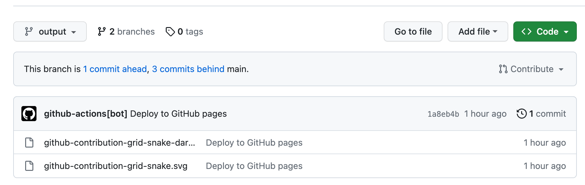

# GitHub 提交记录贪食蛇动画


网上冲浪看到一个同样使用 FixIt 主题的博客[[1]]，首页的贪食蛇动画一下抓住了我的眼球，看到好东西当然要搬过来，一番 Google 后终于成功，来看下最终效果：


整体思路分为两步：
1. 先通过 GitHub Action Platane/snk [[2]] 生成 svg 动画并上传到 GitHub 仓库；
2. 自定义博客首页头像 css，将贪食蛇动画 svg 作为首页头像的背景图片；

## 贪食蛇动画生成
找一个公开仓库添加 GitHub Action 工作流，第一次提交后可手动执行，定时任务等效东八区时间每天早上 5:30 和下午 17:30 执行，以保证贪食蛇动画中的提交记录更新。

```yaml
name: Generate Snake Animation

on:
  workflow_dispatch:
  schedule:
    # equal UTC/GMT+8 "30 5,17 * * *"
    - cron: "30 9,21 * * *"

jobs:
  generate:
    permissions:
      contents: write
    runs-on: ubuntu-latest
    timeout-minutes: 10
    
    steps:
      # https://github.com/Platane/snk
      - name: generate github-contribution-grid-snake.svg
        uses: Platane/snk/svg-only@v3
        with:
          github_user_name: ${{ github.repository_owner }}
          outputs: |
            dist/github-contribution-grid-snake.svg
            dist/github-contribution-grid-snake-dark.svg?palette=github-dark
      # push the content of <build_dir> to a branch
      # the content will be available at https://raw.githubusercontent.com/<github_user>/<repository>/<target_branch>/<file>
      - name: push github-contribution-grid-snake.svg to the output branch
        uses: crazy-max/ghaction-github-pages@v4
        with:
          target_branch: output
          build_dir: dist
        env:
          GITHUB_TOKEN: ${{ secrets.GITHUB_TOKEN }}
```

任务执行后，在仓库的 output 分支可以看到生成的 svg 文件：



## 自定义首页头像 css
参考 FixIt 文档[[3]]，可添加 `assets/css/_custom.scss` 文件进行样式自定义。

通过浏览器控制台定位首页头像元素：


然后添加对应 css 样式：
```scss
// assets/css/_custom.scss
.home .home-profile .home-avatar {
  background-size: 100% 100%;
  padding: 1rem;
  background-repeat: no-repeat;
  background-position: center top;
  background-image: url(https://raw.githubusercontent.com/will4j/blog-resource/output/github-contribution-grid-snake.svg);

  [data-theme='dark'] & {
    background-image: url(https://raw.githubusercontent.com/will4j/blog-resource/output/github-contribution-grid-snake-dark.svg);
  }
}
```

完成收工。

## 参考资料
\[1\]. [个人博客：晴空小筑][1]  
\[2\]. [GitHub 仓库：Platane/snk][2]  
\[3\]. [FixIt 官方文档：自定义样式][3]  

[1]:https://clearsky.me/
[2]:https://github.com/Platane/snk
[3]:https://fixit.lruihao.cn/documentation/advanced/#style-customization


---

> 作者: 水王  
> URL: https://will4j.github.io/posts/github-contribution-grid-snake/  

