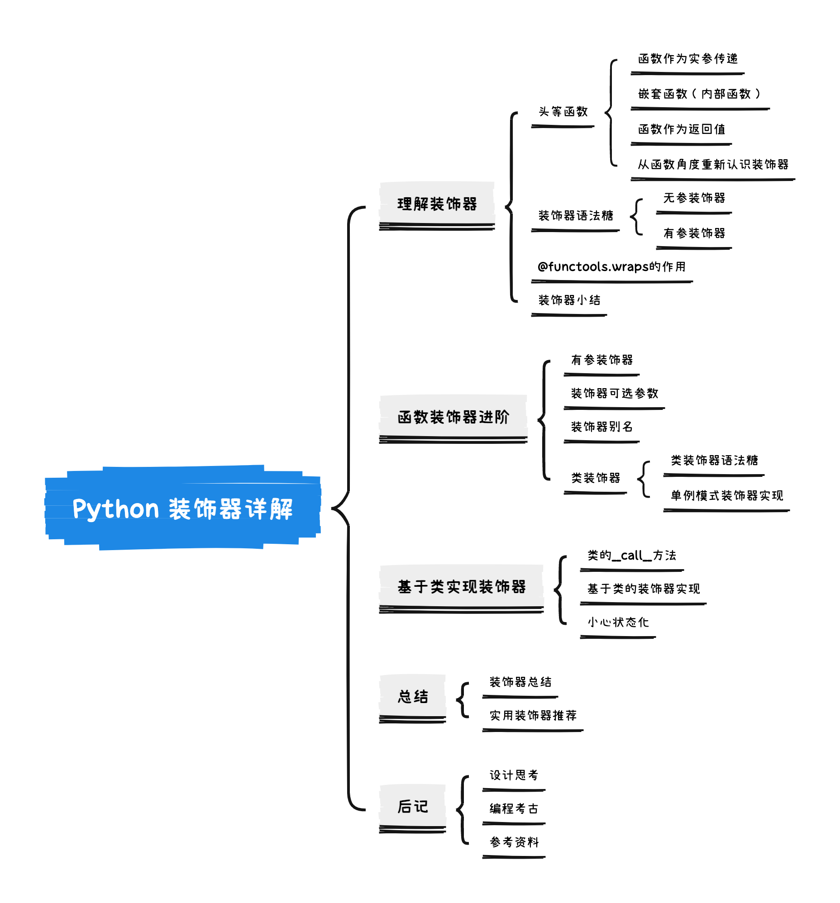
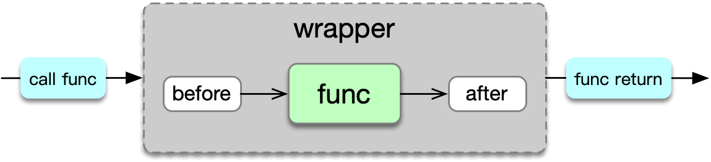

# Python 装饰器详解


> 工欲善其事，必先利其器。—《论语·卫灵公》

本文从装饰器使用到的函数式编程特性入手，讨论了无参装饰器、有参装饰器以及类装饰器三种语法糖规则下装饰器的实现，另外扩展讨论了基于类的实现方式。

总结部分提供了一些实用装饰器的参考资料，后记部分是作者对设计的一些思考，以及行文过程中发现的一些历史事件、奇闻轶事。

希望这篇文章可以帮助你更好地理解装饰器，全文思维导图如下：



## 问题场景

我想创建一个通用的日志装饰器，其作用是在函数调用之后记录参数和返回值，于是在Google一番之后，写下了下面的代码：

```python
import functools
import logging

logging.basicConfig(level=logging.INFO)
logger = logging.getLogger(__name__)

def log(func):
    @functools.wraps(func)
    def wrapper(*args, **kwargs):
        result = func(*args, **kwargs)
        logger.info("function %s called with args=%s kwargs=%s and result=%s", 
                    func.__name__, args, kwargs, result)
        return result
    
    return wrapper

@log
def greeting(name, say="Hello"):
    return f"{say} {name}!"
```

现在执行`greeting`函数会产生如下输出：

```python
>>> greeting("World", say="Hi")
INFO:__main__:function greeting called with args=('World',) kwargs={'say': 'Hi'} and result=Hi World!
'Hi World!'
```

看起来还不错？它足够通用，因为使用了`*args`和`**kwargs`，任何不同签名的其他函数都能通过`log`装饰器打印日志。但也存在一些问题，比如`@functools.wraps`在这里起什么作用？如果需要自定义不同的日志级别该怎么办？如果要自定义`logger`名称又该怎么办？

我需要更深入了解装饰器，才能回答上面这些问题。

## 理解装饰器

也许你知道Java中的注解(`@Annotation`)是通过反射和动态代理来实现的，那么Python中的装饰器呢？可以看到，`log`装饰器本身是一个函数，如果把`greeting`函数上的`log`装饰器去掉，直接像下面这样调用`log`函数，可以得到跟使用装饰器一样的效果：

```python
>>> log(greeting)("World", say="Hi")
INFO:__main__:function greeting called with args=('World',) kwargs={'say': 'Hi'} and result=Hi World!
'Hi World!'
```

把函数作为参数？简单直接，Python装饰器也是这么做的，即在目标函数外部再包裹一层函数，并在目标函数调用前后动态增加行为，很典型的装饰器模式。那么，为什么能如此直接的做到函数作为参数传递及函数嵌套呢？先来了解一下头等函数。

### 头等函数

头等函数[[1]]，其实我更喜欢称之为*一等公民*函数，即在编程语言中，函数作为一等公民，享有完全行为能力，能进行编程语言实体所具备的所有操作，包括但不限于：

- 函数作为实参传递
- 函数作为返回值
- 函数赋值给变量
- 嵌套函数、匿名函数、闭包等

分别来看下装饰器使用到的几个特性：函数作为实参传递、嵌套函数以及函数作为返回值。

#### 函数作为实参传递

典型的例子是Python内置函数`map`，其第一个参数为转换函数，`map`函数执行时会遍历列表，以列表元素作为入参调用转换函数，然后将转换函数返回值组成新的列表返回。比如下面的代码，可以完成对列表中元素求平方的转换。

```python
def square(x):
    return x ** 2
```

```python
>>> map(square, [1, 2, 3, 4])
<map object at 0x102783520>
>>> list(map(square, [1, 2, 3, 4]))
[1, 4, 9, 16]
```

#### 嵌套函数

即在函数内部嵌套声明函数，被嵌套的函数也可以称为内部函数。外部函数的局部变量（包括形参）对内部函数可见。

下面的代码用特定字符打印一个三行的三角形，内部函数`print_line`接收行参数`n`，并在函数体中直接使用了外部函数的`char`变量。

```python
def print_triangle(char):
    def print_line(n):
        print(((2 * n - 1) * char).center(5))
    print_line(1)
    print_line(2)
    print_line(3)
```

```python
>>> print_triangle("*")
  *
 ***
*****
```

#### 函数作为返回值

函数返回值可以是另外一个函数。

在下面的代码中，`times_n`函数返回`product`函数，后者根据参数`n`不同，将返回不同的函数版本，因此`times_n(3)`将返回乘以3的`product`函数`times_3`，调用`times_3(5)`计算将得到结果15。

```python
def times_n(n):
    def product(x):
        return x * n
    
    return product
```

```python
>>> times_3 = times_n(3)
>>> times_3
<function times_n.<locals>.product at 0x1027b96c0>
>>> times_3(5)
15
```

#### 重新认识装饰器

函数在Python中被视为一等公民，对头等函数有了初步了解之后，可以从函数的角度重新认识一下`log`装饰器，关注其中用到的头等函数特性：`func`函数作为入参传递，内部函数`wrapper`作为返回值：

```python
def log(func):  # 1. func函数作为入参传递
    @functools.wraps(func)
    def wrapper(*args, **kwargs):  # 2. 嵌套函数(内部函数)wrapper
        result = func(*args, **kwargs)
        logger.info("function %s called with args=%s kwargs=%s and result=%s", 
                    func.__name__, args, kwargs, result)
        return result
    return wrapper  # 3. 函数作为返回值
```

可以把`log(greeting)("World", say="Hi")`进行分解：

```python
greeting = log(greeting) # 头等函数log的返回值是内部函数wrapper，
												 # 将wrapper赋值给变量greeting，两者都是函数类型
greeting("World", say="Hi") # 使用greeting变量执行，实际调用的是wrapper函数
```

像上面这样分解后，`greeting("World", say="Hi")`调用已经不是原`greeting`函数，实际执行的是内部函数`wrapper`，因而可以在`wrapper`中动态新增行为，即在函数调用后输出日志。

### 装饰器语法糖

从函数的角度重新认识装饰器后，我们知道显式调用`log(greeting)("World", say="Hi")`已经可以达到装饰器的效果，也清楚了调用的过程和原理，那么`@log`的使用方式有什么不同呢？

其实`@`操作符只是一个语法糖，在PEP 318[[2]]中有清晰的描述，其达到的效果如下，即使得：

```python
@dec2
@dec1
def func(arg1, arg2, ...):
    pass
```

等价于：

```python
def func(arg1, arg2, ...):
    pass
func = dec2(dec1(func))
```

同时支持有参装饰器（在函数装饰器进阶一节中将详细讨论有参装饰器），使得：

```python
@decomaker(argA, argB, ...)
def func(arg1, arg2, ...):
    pass
```

等价于：

```python
def func(arg1, arg2, ...):
    pass
func = decomaker(argA, argB, ...)(func)
```

### functools.wraps 的作用

再来看下`@functools.wraps`的作用。

如果去掉`log`装饰器中内部函数`wrapper`上的`@functools.wraps(func)`，查看`greeting`函数对象，会发现它其实是装饰器内部的`wrapper`函数，这符合之前对装饰器原理的理解。

```python
...
def log(func):
    # 移除 @functools.wraps(func)
    def wrapper(*args, **kwargs):
...
@log
def greeting(name, say="Hello"):
...
```

```python
>>> greeting
<function log.<locals>.wrapper at 0x10459e2a0>
```

在`wrapper`上加上`@functools.wraps(func)`后，再查看`greeting`函数对象，发现它仍然是`greeting`函数：

```python
...
def log(func):
    @functools.wraps(func)  # 保留 wraps
    def wrapper(*args, **kwargs):
...
@log
def greeting(name, say="Hello"):
...
```

```python
>>> greeting
<function greeting at 0x10459f4c0>
```

查看`@functools.wraps`的源码发现，它的作用是将`func`函数的部分元数据信息复制给`wrapper`函数，使其伪装成`func`，这些元数据[[3]]包括：函数名称（`__name__`）、函数注释（`__doc__`）以及函数模块路径（`__module__`）等，足够应付大部分场景。

此外，还可以通过`__wrapped__`属性访问被装饰函数的真身：

```python
>>> greeting.__wrapped__
<function greeting at 0x1079e2a20>
>>> greeting.__wrapped__("World")
# 这里并没有打印日志，说明确实调用的是原始greeting函数
'Hello World!'
```

### 装饰器小结

装饰器通过`@`语法糖，使用`wrapper`函数包裹并通过`@functools.wraps`伪装成目标函数`func`，从而达到增强目标函数功能的目的。使用装饰器后，实际调用的是装饰器内的`wrapper`函数，而不再是`func`函数自身，简单示意如下图：



在开头提到的三个问题中，我们已经解答了第一个问题，即`@functools.wraps`的作用。接下来看下如何支持日志级别以及`logger`名称，这需要进阶的装饰器用法。

## 函数装饰器进阶

### 有参装饰器

根据PEP 318[[2]]对`@`操作符语法糖的说明（可以回顾一下[装饰器语法糖](#装饰器语法糖)一节的内容），如果给log装饰器添加日志级别参数，其效果应该如下：

```python
@log(level=logging.INFO)
def greeting(name, say="Hello"):
...
# 那么
greeting("World")
# 应该等价于
log(level=logging.INFO)(greeting)("World")
```

有点太绕了，把中间过程拆解出来再看下：

```python
# 第一步接收参数，返回可访问参数的闭包函数
decorator = log(level=logging.INFO)
# 用闭包函数作为新的装饰器对greeting函数进行包装
greeting = decorator(greeting)
# 调用包装过后装饰器函数
greeting("World")
```

可以看到，相比无参装饰器，有参装饰器引入了一个中间层，负责返回可访问入参的闭包函数，之后这个闭包函数就可以当做无参装饰器来使用。接下来使用这种方式重新实现`log`装饰器以支持自定义日志级别：

```python
import functools
import logging

logging.basicConfig(level=logging.INFO)
logger = logging.getLogger(__name__)

def log(level=logging.INFO):
    def decorator(func):
        @functools.wraps(func)
        def wrapper(*args, **kwargs):
            result = func(*args, **kwargs)
            logger.log(level, "function %s called with args=%s kwargs=%s and result=%s",
                       func.__name__, args, kwargs, result)
            return result
        
        return wrapper
    
    return decorator
```

```python
>>> @log(level=logging.WARNING)
... def greeting(name, say="Hello"):
...     return f"{say} {name}!"
...
>>> greeting("World")
WARNING:__main__:function greeting called with args=('World',) kwargs={} and result=Hello World!
'Hello World!'
>>> @log()
... def greeting(name, say="Hello"):
...     return f"{say} {name}!"
...
>>> greeting("World")
INFO:__main__:function greeting called with args=('World',) kwargs={} and result=Hello World!
'Hello World!'
```

到目前为止效果都很理想✌️。不过不知你有没有注意到，在使用默认参数时，装饰器写法是带空括号的`@log()`，从装饰器语法糖的角度来看，这个空括号还不能去掉，不然的话包裹目标函数的会是中间层的`decorator`，而不是最终期望的`wrapper`，来验证一下：

```python
>>> @log
... def greeting(name, say="Hello"):
...     return f"{say} {name}!"
...
>>> greeting("World")
<function log.<locals>.decorator.<locals>.wrapper at 0x107a95c60>
```

果然如此，这时候调用`greeting`实际上执行的是`decorator`函数，所以返回值是`wrapper`。

### 装饰器可选参数

那么，对于有参装饰器是否能支持不带括号使用呢？这样能使装饰器更加灵活，也能避免因括号遗漏导致编码错误。再次回顾装饰器语法糖，实际期望达到的效果应该如下：

```python
@log
def greeting(name, say="Hello"):
...
# 使得
greeting("World")
# 等价于
log(greeting)("World")

@log(level=logging.INFO)
def greeting(name, say="Hello"):
...
# 使得
greeting("World")
# 等价于
log(level=logging.INFO)(greeting)("World")
```

即装饰器需要同时支持有参和无参两种情况，接下来对`log`装饰器进行改造：

```python
import functools
import logging

logging.basicConfig(level=logging.INFO)
logger = logging.getLogger(__name__)

def log(_func=None, *, level=logging.INFO):
    def decorator(func):
        @functools.wraps(func)
        def wrapper(*args, **kwargs):
            result = func(*args, **kwargs)
            logger.log(level, "function %s called with args=%s kwargs=%s and result=%s",
                       func.__name__, args, kwargs, result)
            return result
        
        return wrapper
    
    if _func is None:
        return decorator
    else:
        return decorator(_func)
```

实际效果验证：

```python
>>> @log
... def greeting(name, say="Hello"):
...     return f"{say} {name}!"
...
>>> greeting("World")
INFO:__main__:function greeting called with args=('World',) kwargs={} and result=Hello World!
'Hello World!'
>>> @log(level=logging.WARNING)
... def greeting(name, say="Hello"):
...     return f"{say} {name}!"
...
>>> greeting("World")
WARNING:__main__:function greeting called with args=('World',) kwargs={} and result=Hello World!
'Hello World!'
```

改造之后的`log`装饰器增加了`_func`参数，总结来说，当`_func`为空时，`log`应该是有参装饰器，否则应该是无参装饰器。同样的逻辑可以使用`partial`[[4]] [[5]]重新实现[[6]]，让代码看起来更直观，同时提取日志名称和日志模板参数，使`log`装饰器更加通用，最终结果如下：

```python
import functools
import logging

logging.basicConfig(level=logging.INFO)

def log(
        func=None,
        *,
        level=logging.INFO,
        name=__name__,
        fmt="function %s called with args=%s kwargs=%s and result=%s",
):
    if func is None:
        return functools.partial(log, level=level, fmt=fmt)
    
    # 将logger获取放到wrapper外部，只会在装饰器解析时执行一次，避免每次函数调用都执行
    logger = logging.getLogger(name)
    
    @functools.wraps(func)
    def wrapper(*args, **kwargs):
        result = func(*args, **kwargs)
        logger.log(level, fmt, func.__name__, args, kwargs, result)
        return result
    
    return wrapper
```

至此，`log`装饰器已经基本完善，开头提出来的日志级别和`logger`名称的问题也得到了解决，不要停下来，跟我一起继续向前探索。

### 装饰器别名

有时候，有参装饰器的某几个参数会在多个场景中重复使用，使代码显得冗余且难以维护，这时可以使用`partial`为装饰器添加别名。还是以`log`为例，试下通过别名来自定义日志模板：

```python
# 装饰器别名，自定义日志模板
my_log = functools.partial(log, fmt="%s executed, args: %s kwargs: %s result: %s")

@my_log
def greeting(name, say="Hello"):
    return f"{say} {name}!"
```

```python
>>> greeting("World")
INFO:__main__:greeting executed, args: ('World',) kwargs: {} result: Hello World!
'Hello World!'
```

函数别名可以快捷方便地做到特定签名的复用，尤其在装饰器以及第三方引入函数的使用上，可以有效消除重复的传参逻辑。

### 类装饰器

到目前为止，装饰器涉及的参与对象都是函数，接下来加入类的场景，装饰器作用在类上有两种方式：一种是装饰类方法，这种方式其实与装饰函数相同；另一种是装饰类声明，其实现由PEP 3129[[7]]定义，语法糖效果如下：

```python
@foo
@bar
class A:
  pass

# 等价于：

class A:
  pass
A = foo(bar(A))
```

装饰器在类声明上主要的用途是修改类的元数据，并且其修改不会被继承，典型的使用场景是内置装饰器`dataclass`，它改变了类的初始化过程，同时提供了属性冻结（只读）等特性。`dataclass`太复杂，下面以一个相对简单的`singleton`装饰器[[8]]来实现装饰类：

```python
import functools

def singleton(cls):
    """Make a class a Singleton class (only one instance)"""
    
    @functools.wraps(cls)
    def wrapper_singleton(*args, **kwargs):
        if not wrapper_singleton.instance:
            wrapper_singleton.instance = cls(*args, **kwargs)
        return wrapper_singleton.instance
    
    # 给wrapper函数创建instance属性并初始化为None
    wrapper_singleton.instance = None
    return wrapper_singleton

@singleton
class TheOne:
    pass
```

```python
>>> a = TheOne()
>>> b = TheOne()
>>> a is b
True
>>> a.x = 5
>>> b.x
5
```

使用`@singleton`装饰类后，类实例创建实际调用的是`wrapper_singleton`函数，函数内部控制返回共享实例，从而达到单例模式的效果。

## 基于类实现装饰器

除了使用函数外，用类也可以实现装饰器，一切只需要符合语法糖的规则，所以前提是类的实例也能像函数一样被调用，而这正是`callable` [[9]]特性所支持的。

在Python中，所有能够被调用（不管是有参还是无参）的对象都属于`callable`对象，除了最直观的函数，类也是`callable`对象（调用类即类的构造函数），实现了`__call__`方法的类实例也一样。

### 类的`__call__`方法

类的`__call__`方法[[10]]达到的效果是把所有对实例的调用都转换为对实例`__call__`方法的调用：

```python
class A:
    def __init__(self, name):
        self.name = name
    
    def __call__(self, say="Hi"):
        return f"{say} {self.name}"
```

```python
>>> a = A("World")
>>> a()
'Hi World'
>>> a("Hello")
'Hello World'
```

### 基于类的装饰器实现

既然类的实例可以被调用，那么使用类来实现装饰器就不是问题了。尝试使用类来重新实现日志打印装饰器，按惯例，先回顾装饰器语法糖，看下期望达到的效果：

```python
class Log:
    pass

@Log
def greeting(name, say="Hello"):
...
greeting("World")
# 应该等价于
Log(greeting)("World")

@Log(level=logging.INFO)
def greeting(name, say="Hello"):
...
greeting("World")
# 应该等价于
Log(level=logging.INFO)(greeting)("World")
```

在无参装饰器场景下，类构造器传入目标函数，`__call__`代理目标函数执行；在有参装饰器场景下，类构造器传入装饰器参数，`__call__`第一次调用传入目标函数，后续调用才是代理执行。具体实现如下：

```python
import functools
import logging

class Log:
    def __init__(
        self,
        func=None,
        *,
        level=logging.INFO,
        name=__name__,
        fmt="function %s called with args=%s kwargs=%s and result=%s",
    ):
        self.level = level
        self.name = name
        self.fmt = fmt
        self.logger = logging.getLogger(self.name)
        self.__update_wrapper(func)
        
    def __update_wrapper(self, func):
        self.func = func
        if func is None:
            return
        functools.update_wrapper(self, func)
        
    def __call__(self, *args, **kwargs):
        if self.func is None:
            self.__update_wrapper(args[0])
            return self
        
        result = self.func(*args, **kwargs)
        self.logger.log(self.level, self.fmt, self.func.__name__, args, kwargs, result)
        return result
```

```python
>>> @Log
... def greeting(name, say="Hello"):
...     return f"{say} {name}!"
...
>>> greeting("World")
INFO:__main__:function greeting called with args=('World',) kwargs={} and result=Hello World!
'Hello World!'
>>> @Log(level=logging.WARNING)
... def greeting(name, say="Hello"):
...     """balabala"""
...     return f"{say} {name}!"
...
>>> greeting("World")
WARNING:__main__:function greeting called with args=('World',) kwargs={} and result=Hello World!
'Hello World!'
```

这版实现看起来很繁琐，框架性的代码占比较大，可以抽取一个装饰器基类[[11]]，封装装饰器构造的公共代码，这样创建新的装饰器就会简洁很多了。

### 小心状态化

基于类的装饰器有个”副作用“，即每次语法糖解析过程都会创建一个类实例，而类实例是状态化的，这意味着同一目标函数的装饰器参数会在多次调用之间共享，所以除非你清楚自己在做什么，千万不要在`__call__`中对装饰器参数进行修改，我就在一个动态SQL执行装饰器中吃过这样的教训。举个例子，下面这段投硬币游戏的代码，一旦出现一次反面，结果就永远是反面了：

```python
import random

class ConsoleDisplay:
    def __init__(self, func):
        self.func = func
        self.message = "heads"
        
    def __call__(self, *args, **kwargs):
        res = self.func(*args, **kwargs)
        if not res:
            self.message = "tails"
        self.print_message()
        
    def print_message(self):
        print(self.message)

@ConsoleDisplay
def flip_the_coin():
    return random.choice([True, False])
```

```python
>>> flip_the_coin()
heads
>>> flip_the_coin()
tails
>>> flip_the_coin()
tails
...
# tails x 1000 (doge)
```

## 总结

Python装饰器初看很简单，但是要构建一个通用且稳定的装饰器却是一项比较有挑战性的工作。

首先要知道`@`语法糖的规则，清楚无参装饰器、有参装饰器以及类装饰器三种场景各自的执行过程，这可以说是装饰器世界的三项基本法则。其次是关于头等函数，理解函数作为实参传递、内部函数以及函数作为返回值的用法，这些是装饰器世界运转的三个前提条件。

三项基本法则和三个前提条件是我在Python装饰器世界中发现的不变的部分，我把它们分享给你。

使用装饰器可以实现很多非常极客的功能，比如单例模式、缓存、数据校验、注册事件监听者、异步调用等，有些功能也许你已经使用过，下次再遇到不妨停下来看看源码，相信你已经能够一眼就看懂它的实现了。限于篇幅，实战部分不再展开，可参考资料[[8]][[12]]，里面有很多实用装饰器，酷壳[[12]]中甚至引用了一个装饰器合集[[13]]，里面有40多个实用装饰器，牛哇。

最后，再奉上一份后台任务装饰器代码[[14]]，作抛砖引玉之用，以上。

## 后记

### 设计思考

1. 函数式编程
   
    作为一种编程范式，跟面向过程编程相比，函数式编程重视结果多于过程。这种倾向一方面体现为使用声明式而非指令式，即函数应该描述做了什么而不是怎么做；另一方面体现为不可变性或者说无状态化，即相同的参数调用函数总能得到一致的结果。
    
    函数式编程实际上是将复杂的大问题分解成相对简单的独立子问题，简单子问题更容易求解和保证正确性。
    
2. 关注点分离
   
    封装的精髓所在，使用装饰器可以将一些通用逻辑抽离成独立的模块，比如日志、权限、缓存，一方面可以减少重复，另一方面可以让专业的“人”做专业的事情，日志装饰器只关注日志，它的目的就是把日志打出花来 :)。
    

### 编程考古

1. 2002年10月14日，Python 2.2.2 版本发布，引入了`staticmethod`和`classmethod`，使用方式[纯靠手动](https://www.python.org/download/releases/2.2.2/descrintro/#staticmethods)，如`foo = staticmethod(foo)`，期望未来会有一个语法来解决这个问题的种子在彼时就被埋下了。
2. 2002年2月至2004年7月，与装饰器语法相关的讨论在社区持续进行，无数的提案被提交，如单词类的`as`、`using`等，符号类的`;...`、`<…>`、`|…`、`[…]`等，其中`[…]`是`@…`的强力竞争者。
3. 2003年6月5日，定义装饰器规范的PEP 318[[2]]创建，彼时的标题还是`pep 318, Decorators for Functions, Methods and Classes`，PEP 318经多次修改，历时近14个月，最终只支持函数和方法装饰器。
4. 2004年6月7日至9日，欧洲Python开发者大会召开，Python之父Guido携带社区提案到会上进行讨论，但仍未有结论。
5. 2004年7月30号，”Pie-Thon”挑战（2003年Parrot虚拟机开发者Dag发起的挑战，比较Python通过Parrot虚拟机和CPython运行的性能）在OSCON上兑现，作为赢家的Guido可以往Dag脸上丢一个奶油派，社区普遍认为这个事件对Guido最终决定使用`@`具有重要作用，因而很多人称之为“命运之派“。
6. 2004年8月2日，Anthony在Guido授意下提交了一版`@`[装饰器实现](https://mail.python.org/pipermail/python-dev/2004-August/046599.html)，因为形状类似派，Barry给它取了个外号叫”[派-装饰器](https://mail.python.org/pipermail/python-dev/2004-August/046613.html)“。

## 参考资料

\[1\]. [维基百科：头等函数][1]  
\[2\]. [PEP 318 – Decorators for Functions and Methods][2]  
\[3\]. [Python documentation: User-defined functions][3]  
\[4\]. [Python documentation: functools.partial][4]  
\[5\]. [Python documentation: partial-objects][5]  
\[6\]. [Python Cookbook 3rd Edition: 9.6 带可选参数的装饰器][6]  
\[7\]. [PEP 3129 – Class Decorators][7]  
\[8\]. [realpython: primer-on-python-decorators][8]  
\[9\]. [Python documentation: term-callable][9]  
\[10\]. [Python documentation: Emulating callable objects][10]  
\[11\]. [people-doc: Class-based decorators with Python][11]  
\[12\]. [酷壳：PYTHON修饰器的函数式编程][12]  
\[13\]. [PythonDecoratorLibrary][13]  
\[14\]. [gist: add background task with task register decorator][14]  

[1]:https://zh.wikipedia.org/wiki/%E5%A4%B4%E7%AD%89%E5%87%BD%E6%95%B0
[2]:https://peps.python.org/pep-0318/
[3]:https://docs.python.org/3/reference/datamodel.html?highlight=__doc__#user-defined-functions
[4]:https://docs.python.org/3/library/functools.html#functools.partial
[5]:https://docs.python.org/3/library/functools.html#partial-objects
[6]:https://python3-cookbook.readthedocs.io/zh-cn/latest/c09/p06_define_decorator_that_takes_optional_argument.html
[7]:https://peps.python.org/pep-3129/
[8]:https://realpython.com/primer-on-python-decorators/
[9]:https://docs.python.org/3/glossary.html#term-callable
[10]:https://docs.python.org/3/reference/datamodel.html#emulating-callable-objects
[11]:https://tech.people-doc.com/python-class-based-decorators.html
[12]:https://coolshell.cn/articles/11265.html
[13]:https://wiki.python.org/moin/PythonDecoratorLibrary
[14]:https://gist.github.com/will4j/21f8cefbd32ea5684cb9353521cabceb


---

> 作者: [水王](https://github.com/will4j)  
> URL: https://will4j.github.io/posts/python-decorator-explained/  

