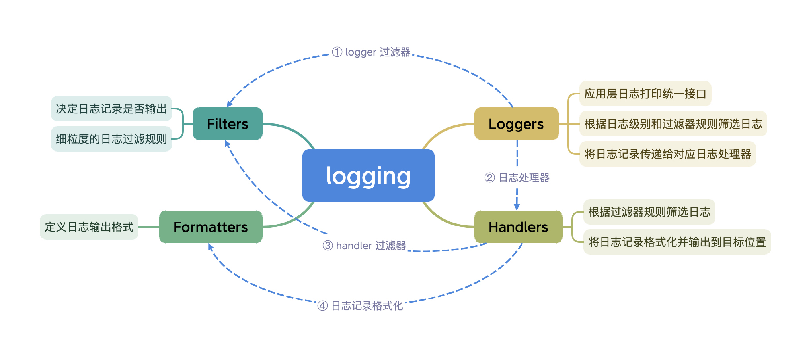
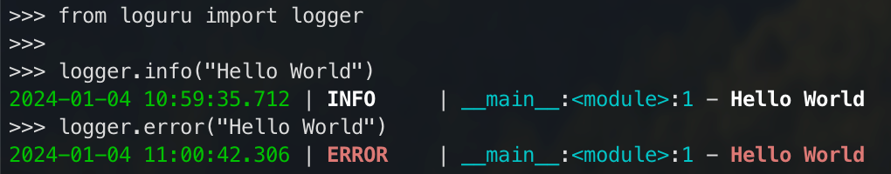
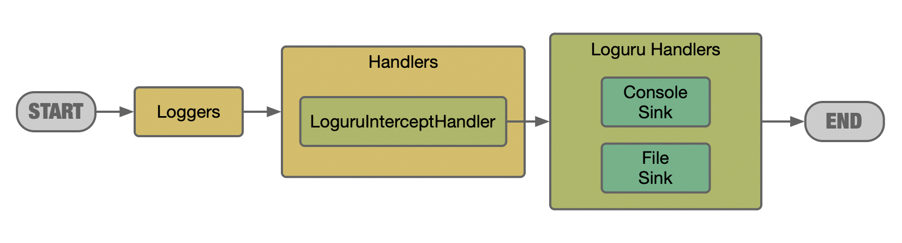

# Python 工程化：Loguru 日志集成



这篇文章综合考虑标准日志模块的统一接口以及 `Loguru` 日志框架的简便性，采用仅以标准日志模块作为日志门面，实际日志使用 `Loguru` 来输出的方案，并提供了方案的具体实现。通过这种方式，项目可以使用如 `YAML` 等纯文本配置文件进行日志配置，日志打印时只使用标准日志模块接口，使得业务代码和具体日志实现相隔离。


日志在开发中的地位不言而喻，规范的日志一如“书同文，车同轨”一般，不仅能灵活的进行日志搜索和过滤，更能清晰的展示业务流程，成为跨系统调用的“硬通货”。在排查线上问题时，关键日志往往能提供重要线索，帮助从一团乱麻中快速定位问题，甚至能省下数小时时间。更进一步，日志也作为系统的数据资产，从海量日志中可以分析出很多有价值的业务信息。

## Python 日志方案

### Python 标准日志模块
Python 标准日志模块[[1]] `logging` 由 PEP 282 提案[[2]]引入，其最大的好处是提供了全 Python 环境统一的日志接口，使得所有 Python 模块的日志得以整合，也就是说除了记录应用本身的日志外，第三方模块的日志也可以一同记录，从而为应用提供更全面完备的日志信息。

标准日志模块按照层级结构组织[[3]]，核心包括四类组件：`loggers`，`handlers`，`filters` 和 `formatters`，它们之间的关系如下图所示：



除了根据日志级别直接进行过滤外，日志输出的主体流程分为四步（详细流程可参考[[4]]）：
1. `logger` 创建日志记录，首先根据 `logger` 过滤器规则对日志进行筛选；
2. `logger` 将筛选出的日志记录传递给对应的日志处理器 `handlers` 处理；
3. 每个 `handler` 根据其自身的过滤器规则筛选出需要处理的日志记录；
4. `handler` 将筛选出的日志记录使用 `formatter` 格式化后进行输出；

标准日志模块使用示例如下：

```python
>>> import logging
>>>
>>> logging.basicConfig(level=logging.INFO)
>>>
>>> logger = logging.getLogger(__name__)
>>>
>>> logger.info("Hello World")
INFO:__main__:Hello World
```

### Loguru 日志框架

Loguru [[5]]是最受欢迎的 Python 第三方日志框架，提供开箱即用的日志入口，同时支持彩色日志输出，使用效果如下：



在配置方式上，Loguru 摒弃了标准日志模块的 `loggers`，`handlers` 等层级结构，统一采用 `add` 方法，使得配置非常简单：

```python
>>> from loguru import logger
>>>
>>> logger.add("out_{time}.log", rotation="500 MB")
1
>>> logger.info("Hello World")
2024-01-04 11:06:12.237 | INFO     | __main__:<module>:1 - Hello World
```
```shell
$ cat out_2024-01-04_11-06-00_178249.log
2024-01-04 11:06:12.237 | INFO     | __main__:<module>:1 - Hello World
```

另外，Loguru 支持包含运行时变量值的堆栈打印，可以直观的看到调用上下文信息，以除零异常为例：

```python
# main.py
from loguru import logger

def divide(a, b):
    return a / b

def nested(c):
    try:
        return divide(5, c)
    except Exception as e:
        logger.exception(e)

if __name__ == '__main__':
    nested(0)
```
```shell
$ python main.py
2024-01-04 10:44:02.288 | ERROR    | __main__:nested:10 - division by zero
Traceback (most recent call last):

  File "main.py", line 13, in <module>
    nested(0)
    └ <function nested at 0x1036a1080>

> File "main.py", line 8, in nested
    return divide(5, c)
           │         └ 0
           └ <function divide at 0x10364a340>

  File "main.py", line 4, in divide
    return a / b
           │   └ 0
           └ 5

ZeroDivisionError: division by zero
```


生产环境日志配置应该通过 `diagnose=False` 参数关闭堆栈详情打印，以避免泄露敏感信息。


### 日志方案选择

总体来看，Python 标准日志模块提供统一的日志接口且功能强大，但是其配置相对复杂，在日志输出样式以及对异常诊断的帮助上表现不如 Loguru；后者在一定程度上补齐了标准日志模块的短板，然而其使用具有一定的侵入性，一方面使得项目代码跟日志框架耦合，另一方面也不利于整合其他模块日志。

回忆上面介绍的日志输出主体流程，可以将 Loguru 配置为标准日志模块的 `Handler`。业务代码仍然通过标准日志模块打印日志，实际的日志输出通过 Loguru 执行，从而达到日志实现与业务代码隔离的目的。

这种方式非常类似于 Java 中的 `slf4j`，也是面向接口编程思想的实践。 

## Loguru 日志集成

### 基于字典的日志配置

Python 从 PEP 391 [[6]] 开始支持基于字典的日志配置，考虑字典是为了提供最大的扩展性，像 `JSON` 以及 `YAML` 等格式都可以转换成字典，进而也可以用于进行日志配置。

为了能使用纯文本完成日志配置，PEP 391 定义了一些特殊解析器。

#### Python 对象访问解析器

格式为 `ext://xxx.xxx`，当需要使用到 Python 系统路径中的对象时使用，最常用的例子是引用标准控制台输出流，以 `YAML` 格式为例：

```yaml
handlers:
  console:
    class: logging.StreamHandler
    formatter: brief
    level: INFO
    stream: ext://sys.stdout
```

除开 `ext://` 前缀的其他部分将等效使用 `import` 导入使用。

#### 日志配置访问解析器

格式为 `cfg://xxx.xxx`，当需要引用当前日志配置中的配置节点时使用，支持通过 `.` 嵌套访问子元素、通过 `[0]` 访问数组内元素，使用示例如下：

```yaml
handlers:
  email:
    class: logging.handlers.SMTPHandler
    mailhost: localhost
    fromaddr: my_app@domain.tld
    toaddrs:
      - support_team@domain.tld
      - dev_team@domain.tld
    subject: Houston, we have a problem.
  custom:
    (): my.package.MyHandler
    host: 'cfg://handlers.email.mailhost'
    addr: 'cfg://handlers.email.toaddrs[0]'
```

#### 用户自定义对象

支持使用类和 `callable` 对象作为工厂，类工厂使用 `class` 关键字配置，`callable` 工厂使用 `()` 特殊关键字配置。除 `formatters`、`filters` 等特殊配置外，同级的其他参数将作为工厂的入参传入。

类工厂的例子可以参考上一小节的 `SMTPHandler` 配置，解析时会触发其构造函数调用：`SMTPHandler(mailhost='localhost', fromaddr='my_app@domain.tld', toaddrs=...`。

`callable` 工厂的例子如下：

```yaml
formatters:
  custom:
    (): my.package.customFormatterFactory
    bar: baz
    spam: 99.9
    answer: 42
```

以上配置解析时会执行 `my.package.customFormatterFactory(bar='baz', spam=99.9, answer=42)`。

以上几个解析器已经可以覆盖掉大部分的配置场景了。

### Loguru 日志处理器实现

可以通过配置 Loguru 拦截器的方式拦截标准日志模块输出[[7]]，流程示意如下图所示：



Loguru 支持通过 `logger.configure()` 方法完成日志配置，所有配置参数可通过 `LoguruInterceptHandler` 构造函数获取，而构造函数可以通过标准日志模块字典配置的类工厂引入。

#### yaml 配置样例

使用类似下面的 YAML 配置初始化标准日志模块，期望将 `loguru_config` 属性传递给 `logger.configure()` 完成 loguru 配置，要达到的效果如下：

1. 通过 `loguru_format` 配置日志输出格式；
2. 配置三个日志输出项，分别为 `stdout`、`stderr` 以及日志文件 `file.log`；
3. 使用 `loguru_logging.compact_name_format` 函数进行格式化，其作用是压缩日志中的路径，比如 `long.module.dir.log` 压缩后输出为 `l.m.dir.log`；
4. 支持 `lambda://` 前缀声明 lambda 表达式，达到 `stdout` 不输出 `ERROR` 级别的效果；
5. 日志文件 `file.log` 每天零点压缩归档，压缩格式为 `tar.gz`；

```yaml
# logging.yml
# https://docs.python.org/3/library/logging.config.html#configuration-dictionary-schema
version: 1
disable_existing_loggers: false
root:
  handlers:
    - loguru
  level: INFO
handlers:
  loguru:
    class: loguru_logging.LoguruInterceptHandler
    # constructor param starts with loguru_
    loguru_format: "<green>{time:YYYY-MM-DD HH:mm:ss.SSS}</green> | <level>{level: <8}</level> | <cyan>{name}</cyan>:<cyan>{function}</cyan>:<cyan>{line}</cyan> - <level>{message}</level>"
    loguru_config:
      # https://loguru.readthedocs.io/en/stable/api/logger.html#loguru._logger.Logger.configure
      handlers:
        # param: https://loguru.readthedocs.io/en/stable/api/logger.html#loguru._logger.Logger.add
        - sink: ext://sys.stdout
          level: INFO
          format: ext://loguru_logging.compact_name_format
          filter: 'lambda://record:record["level"].no < logging.ERROR'
        - sink: ext://sys.stderr
          level: ERROR
          format: ext://loguru_logging.compact_name_format
        - sink: "file.log"
          rotation: "00:00"
          compression: "tar.gz"
          level: INFO
          format: ext://meta_repository.loguru_logging.compact_name_format

```

完整的配置支持可参考基于字典的标准日志模块配置[[6]]以及 `logger.configure()` API 文档[[8]]。

#### 拦截器实现

接下来基于示例 YAML 配置文件的声明，进行拦截器实现，主要包括：

1. `LoguruInterceptHandler` 类构造函数接收配置参数，并在构造函数中完成日志配置；
2. 继承 `logging.config.BaseConfigurator` 实现 loguru 配置类 `LoguruDictConfigurator`，以复用路径解析、 `ext://` 前缀等功能；
3. 参考 `logger.configure()` api 文档，在 `LoguruDictConfigurator.configure` 方法中构造 loguru 配置参数；
4. 扩展 `value_converters` 支持 `lambda://` 前缀表达式；
5. 实现 `compact_name_format` 动态格式化函数，对 `name` 进行压缩；

具体实现如下：

```python
import inspect
import logging
import os
import re
from logging.config import BaseConfigurator

from loguru import logger

# _global_loguru_format may be changed by LoguruInterceptHandler
_global_loguru_format = os.getenv(
    "LOGURU_FORMAT",
    "<green>{time:YYYY-MM-DD HH:mm:ss.SSS}</green> | "
    "<level>{level: <8}</level> | "
    "<cyan>{name}</cyan>:<cyan>{function}</cyan>:<cyan>{line}</cyan> - <level>{message}</level>",
)


def compact_name_format(record) -> str:
    """ loguru dynamic formatter

    :param record: log record
    :return:
    """
    compact_name = compact_path(record["name"])

    def format_name(match):
        return match.group().format_map({"name": compact_name})

    return re.sub(r"{name(:.*?)?}", format_name, _global_loguru_format) + "\n{exception}"


class LoguruInterceptHandler(logging.Handler):
    """intercept standard logging messages toward loguru

    https://github.com/Delgan/loguru#entirely-compatible-with-standard-logging
    """

    def __init__(self, loguru_config: dict = None, loguru_format: str = None):
        super().__init__()
        self.loguru_config = loguru_config
        if loguru_format:
            global _global_loguru_format
            _global_loguru_format = loguru_format
        self.configure_loguru()

    def emit(self, record: logging.LogRecord) -> None:
        # Get corresponding Loguru level if it exists.
        level: str | int
        try:
            level = logger.level(record.levelname).name
        except ValueError:
            level = record.levelno

        # Find caller from where originated the logged message.
        frame, depth = inspect.currentframe(), 0
        while frame and (depth == 0 or frame.f_code.co_filename == logging.__file__):
            frame = frame.f_back
            depth += 1

        logger.opt(depth=depth, exception=record.exc_info).log(level, record.getMessage())

    def configure_loguru(self):
        LoguruDictConfigurator(self.loguru_config).configure()


class LoguruDictConfigurator(BaseConfigurator):
    value_converters = BaseConfigurator.value_converters | {
        "lambda": "lambda_convert",
    }

    # https://loguru.readthedocs.io/en/stable/api/logger.html#loguru._logger.Logger.configure
    def configure(self):
        loguru_config = {}
        config = self.config

        # list of dict
        if "handlers" in config:
            handlers_config = config.get("handlers", [])
            handlers = []
            for handler_dict in handlers_config:
                _handler = self.configure_handler(handler_dict)
                handlers.append(_handler)
            if handlers:
                loguru_config["handlers"] = handlers

        # list of dict
        if "levels" in config:
            loguru_config["levels"] = config["levels"]

        # dict
        if "extra" in config:
            loguru_config["extra"] = config["extra"]

        # callable
        if "patcher" in config:
            _patcher = config["patcher"]
            loguru_config["patcher"] = self.resolve(_patcher)

        # list of tuple
        if "activation" in config:
            activation_config = config.get("activation", [])
            activations = []
            for activation_dict in activation_config:
                _activation = self.configure_activation(activation_dict)
                activations.append(_activation)
            if activations:
                loguru_config["activation"] = activations

        logger.configure(**loguru_config)  # type: ignore

    def configure_handler(self, config: dict) -> dict:
        # https://loguru.readthedocs.io/en/stable/api/logger.html#loguru._logger.Logger.add
        handler = {}

        _sink = config.pop("sink", None)
        handler["sink"] = self.convert(_sink)

        _format = config.pop("format", None)
        if _format:
            handler["format"] = self.convert(_format)
        else:
            handler["format"] = _global_loguru_format

        _filter = config.pop("filter", None)
        if _filter:
            handler["filter"] = self.convert(_filter)

        # rest config use as it is
        handler.update(config)
        return handler

    def configure_activation(self, config: dict) -> tuple:
        if len(config) != 1:
            raise ValueError('Unable to configure activation, should only have one item per element but got '
                             '%r' % config)
        key, value = config.popitem()
        return key, value

    def lambda_convert(self, value):
        """Default converter for the lambda:// protocol."""
        return eval("lambda " + value)


def compact_path(path: str, retain=2) -> str:
    """通过压缩路径前缀简化路径输出

    :param path: 原始路径，如：infrastructure.adapters.socketio.namespaces
    :param retain: 保留层级，默认2
    :return: 前缀缩写后的路径，如：i.a.s.namespaces.teach_namespace
    """
    if not path or retain < 1 or path.count(".") < retain:
        return path

    slices = path.split(".")
    # i.a.s.namespaces.teach_namespace
    return ".".join([s[0] for s in slices[:-retain] if s]) + "." + ".".join(slices[-retain:])
```

## 总结

具体实现看起来比较复杂，但实际上只是把复杂的事情做一次，后续简单的事情重复 n 次，所获得的收益还是值得的。

使用这种配置方式，只需要在项目根目录配置好对应的 `logging.yml`，然后在项目入口完成日志配置，比如：

```python
import logging.config

import yaml

# 初始化日志配置文件
with open('logging.yml', "r") as conf:
    conf_dict = yaml.load(conf, Loader=yaml.FullLoader)
    logging.config.dictConfig(conf_dict)

if __name__ == '__main__':
    app.run()

```

其他模块通过标准日志模块打印日志即可，如：

```python
import logging

logger = logging.getLogger(__name__)

def demo_function():
    logger.info("This is a standard log but will log by loguru.")

```

## 参考资料

\[1\]. [Logging facility for Python, Python Docs][1]  
\[2\]. [PEP 282 – A Logging System][2]  
\[3\]. [Advanced Logging Tutorial, Python Docs][3]  
\[4\]. [Logging Flow, Python Docs][4]  
\[5\]. [Features of Loguru][5]  
\[6\]. [PEP 391 – Dictionary-Based Configuration For Logging][6]  
\[7\]. [loguru compatible with standard logging][7]  
\[8\]. [logger.configure() api of Loguru][8]  

[1]: https://docs.python.org/3/library/logging.html
[2]: https://peps.python.org/pep-0282/
[3]: https://docs.python.org/3/howto/logging.html#advanced-logging-tutorial
[4]: https://docs.python.org/3/howto/logging.html#logging-flow
[5]: https://loguru.readthedocs.io/en/stable/overview.html#features
[6]: https://peps.python.org/pep-0391/
[7]: https://loguru.readthedocs.io/en/stable/overview.html#entirely-compatible-with-standard-logging
[8]: https://loguru.readthedocs.io/en/stable/api/logger.html#loguru._logger.Logger.configure


---

> 作者: 水王  
> URL: https://will4j.github.io/posts/python-loguru-logging/  

